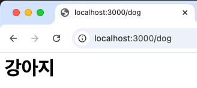
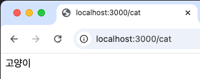
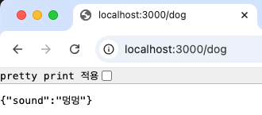
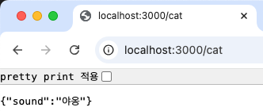
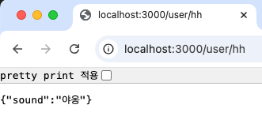
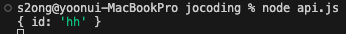
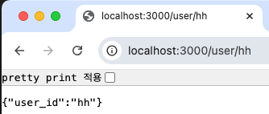
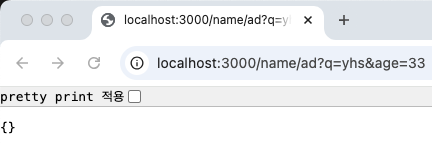
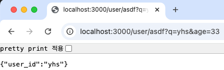
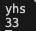

# api 만들어 보기
 GET /dog => {'sound' : '멍멍'}  
 GET /cat => {'sound' : '야옹'}

## 문자열, html태그로 응답
>const express = require('express')  
const app = express()    
app.get('/', function (req, res) {  
  &nbsp; res.send('Hello World')  
})  
app.get('/dog', function (req, res) {  
  &nbsp; res.send('\<h1>강아지\</h1>')  
})  
app.get('/cat', function (req, res) {  
  &nbsp; res.send('고양이')  
})  
app.listen(3000)

문자열 뿐만 아니라 html 태그로 전송도 가능함

결과 )

  
  

## json데이터로 응답

>res.send({'sound' : '멍멍'})  
= res.json({'sound' : '멍멍'})  
res.send({'sound' : '야옹'})  
= res.json({'sound' : '야옹'}) 

결과 )  

  
  

## 변수에 담아서 요청해보기

- GET 방식(주소창을 이용해 받는 방식)  
    1) parameter(params)  
       
       라우터 - ':' + 'parameter이름'

       실행1 )  
       > app.get('/user/:id', function (req, res) {  
         const q = req.params  
         console.log(q)  
         res.send({'sound' : '야옹'})  
         })

       결과1 )  
         
         
       
       실행2 )  
       > app.get('/user/:id', function (req, res) {  
         const q = req.params  
         console.log(q.id)  
         res.send({'user_id' : q.id})  
         })

       결과2 )  
         
        => id에 입력한 데이터가 바로 출력됨

    2) query
       라우터 - '?' + key값 + '=' + value값 (+ '&' + key값 + '=' + value값)
       &로 연결가능

       실행1 )  
       > app.get('/user/:id', function (req, res) {  
         const q = req.query  
         console.log(q)  
         res.send({'user_id' : q.id})  
         })

       결과1 )  
         
         

        실행2 )  
       > app.get('/user/:id', function (req, res) {  
         const q = req.query  
         console.log(q.q)  
         console.log(q.age)   
         res.send({'user_id' : q.q})  
         })

       결과2 )  
         
        

- POST 방식(exios,fetch이용할 때 사용)  
  1) parameter(params) : GET방식과 같음 
  2) body : body에 json데이터 형식으로 받아옴