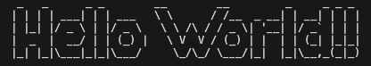

# npm(node package manager)
https://www.npmjs.com/  
-> 필요한 module을 검색해서 가져다 사용할 수 있음

## npm init 으로 패키지 관리하기
\*init = initialize (편집)  

``` npm init ```  

입력 후 package.json 파일이 생성됨

> <package.json>  
{  
  "name": "jocoding_basic",(프로젝트 이름)  
  "version": "1.0.0",(버전)  
  "main": "npm.js",(메인으로 실행될 파일)  
  "scripts": {  
    &nbsp; &nbsp; "test": "echo \"Error: no test specified\" && exit 1"  
  },  
  "author": "",  
  "license": "ISC",  
  "description": ""  
}  

npm에서 모듈을 다운 받고 적용할 때 어떤 모듈이 설치 되었는지, 프로젝트의 이름, 버전 등이 기록됨  
package.json없이도 사용가능함 깔끔한 관리를 위해 설치


## npm 으로 모듈 설치 후 사용해보기

- 설치  
 npm 사이트에서 모듈이름 검색 후 설치코드 입력해줌

  ``` npm install figlet(아스키아트 모듈) ```

  - --save : package.json에 기록을 위해 붙여야 했는데 요즘은 생략가능
  - -g : 컴퓨터 전역에 설치됨(다른 디렉토리에서도 모듈 사용이 가능함)  

  설치 후 )   
   package.json 파일에 figlet모듈의 간략한 내용이 추가됨  
   > "dependencies": {  
    &nbsp;  "figlet": "^1.8.0"  
   }  

   package-lock.json 파일이 생성됨  
   package-lock.json은 설치한 모듈의 자세한 정보가 기록됨  
   > "node_modules/figlet": {  
      &nbsp; "version": "1.8.0",  
      &nbsp; "resolved": "https://registry.npmjs.org/figlet/-/figlet-1.8.0.tgz",  
      &nbsp; "integrity": "sha512-chzvGjd+Sp7KUvPHZv6EXV5Ir3Q7kYNpCr4aHrRW79qFtTefmQZNny+W1pW9kf5zeE6dikku2W50W/wAH2xWgw==",  
      &nbsp; "license": "MIT",  
      &nbsp; "bin": {  
        &nbsp; &nbsp; "figlet": "bin/index.js"  
      &nbsp; },  
      &nbsp; "engines": {  
        &nbsp; &nbsp; "node": ">= 0.4.0"  
      &nbsp; }  
    }  
 
 - 사용해보기  
  공식 문서에서 Simple usage 내용을 복사해 붙여넣기 해줌  

    >var figlet = require("figlet");  
    figlet("Hello World!!", function (err, data) {  
    &nbsp; if (err) {  
      &nbsp; &nbsp; console.log("Something went wrong...");  
      &nbsp; &nbsp; console.dir(err);  
      &nbsp; &nbsp; return;  
    &nbsp; }  
    &nbsp; console.log(data);  
  });  

    파일 실행 )  
    ``` node npm.js ```

    결과 )  
  
                                                         

- 삭제  
  npm 사이트에서 삭제코드 입력해줌
  
  ``` npm uninstall figlet ```

  package.json에서 figlet이 사라진것을 확인할 수 있음